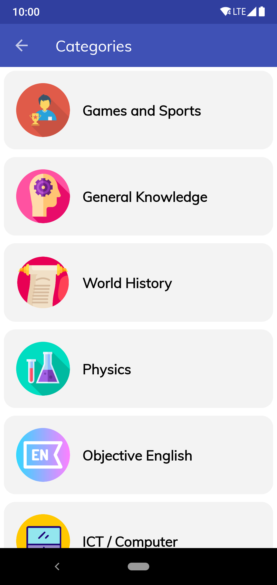
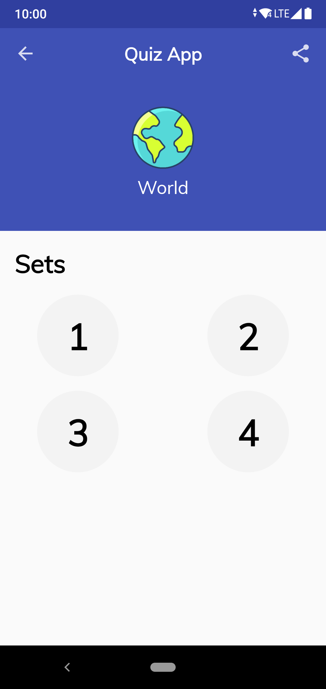
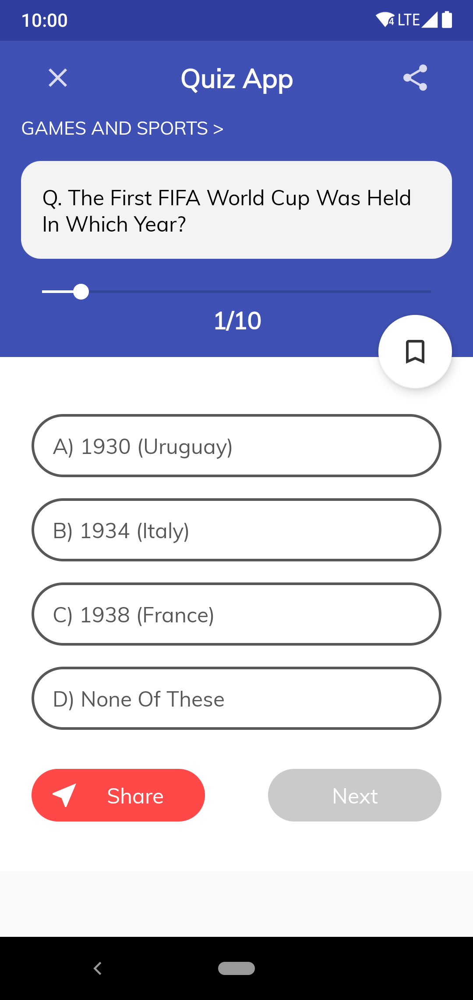
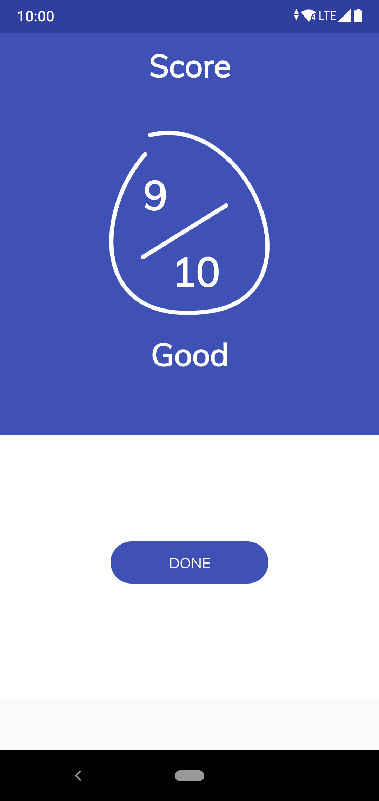

# Quiz-App
Fun, addictive, challenging, online quiz app.

&nbsp;&nbsp;&nbsp;&nbsp;&nbsp;&nbsp;&nbsp;&nbsp;
&nbsp;&nbsp;&nbsp;&nbsp;&nbsp;&nbsp;&nbsp;&nbsp;
&nbsp;&nbsp;&nbsp;&nbsp;&nbsp;&nbsp;&nbsp;&nbsp;
&nbsp;&nbsp;&nbsp;&nbsp;&nbsp;&nbsp;&nbsp;&nbsp;
&nbsp;&nbsp;&nbsp;&nbsp;&nbsp;&nbsp;&nbsp;&nbsp;

# Difficulty

1) Loading data from Firebase (Recycler View and Gridview).
2) Thinking About Firebase Database Structure.
3) Loading Images (i used circle image view & Glide to laod images).
4) Adding Animation and thinkig abuot is it suit or not!
5) Thinking about design & color (when you don't have scratch file, you have to think about every element).
6) Adding qus to the firebase databse also boaring..
7) Finally, I learn a lot form this project.
